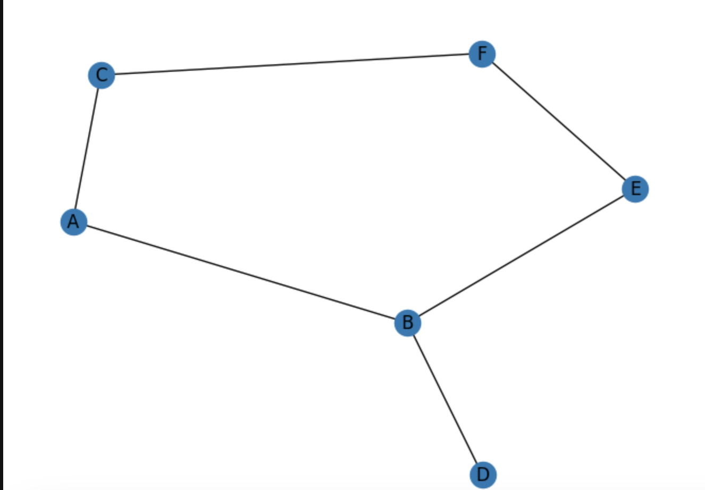

## Пошук у графах: алгоритми DFS і BFS та їх реалізації

Пошук в графі відбувається з наступною послідомністю:

```
DFS:  ['A', 'B', 'D', 'E', 'F', 'C']
BFS:  ['A', 'C', 'B', 'F', 'D', 'E']
```




Ми маємо самме таку послідомність тому що пошук в ширину спочатку працює з сусідніми нодами, а потім йде глибше. Тому починаючи з вершини A ми спочатку побачимо B і C. З пошуком в глибину протилежна ситуація, від A ми пішли глибше по гілці B, до C ми дійшли в останню чергу.